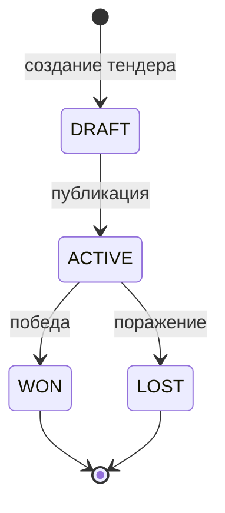
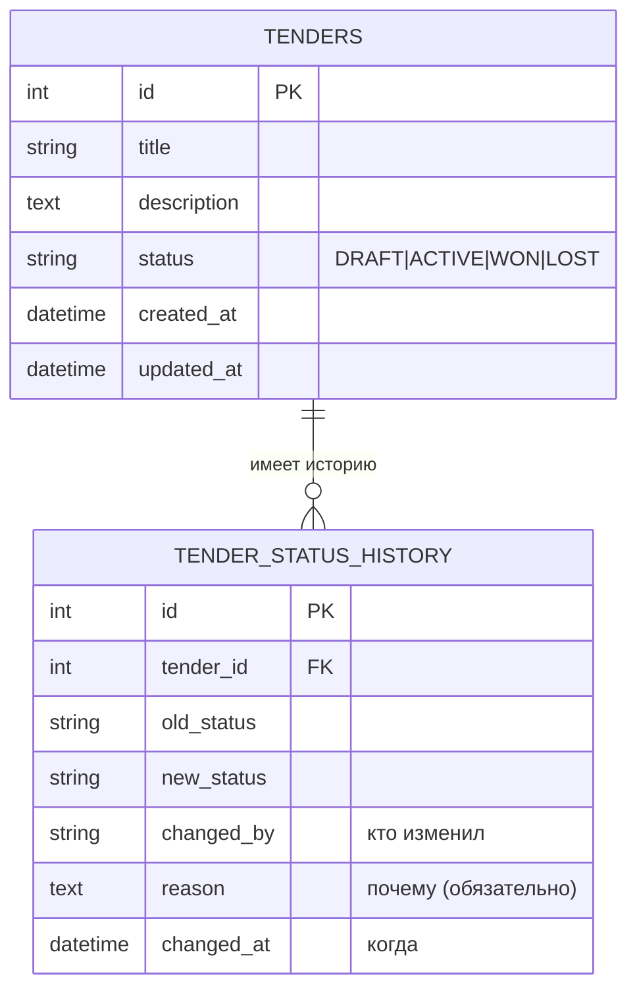

# Логика решения и алгоритм

Документ описывает архитектуру и алгоритм работы микросервиса
трекинга статуса тендеров.

## 1. Постановка задачи

Нужен сервис, который:
1. Создаёт тендер.
2. Обновляет статус тендера: Черновик, Активен, Выигран, Проигран.
3. Логирует каждое изменение статуса в отдельную таблицу истории:
   кто изменил, когда и почему.

## 2. Выбор стека

- **Django + DRF** — зрелая ORM, миграции и сериализаторы из коробки,
  что ускоряет разработку и упрощает поддержку.
- **Сервисный слой** — бизнес-правила отделены от HTTP-слоя,
  их легко тестировать без поднятия сервера.

Слои приложения:

```
HTTP-запрос
   ↓
view (serializers + views)   — валидация входа, формат ответа
   ↓
service (services.py)        — бизнес-правила, транзакция
   ↓
model (models.py)            — данные и таблица истории
```

## 3. Конечный автомат статусов

Статусы тендера образуют конечный автомат. Правила переходов
заданы матрицей `ALLOWED_TRANSITIONS` в `constants.py`.



| Из \ В   | DRAFT | ACTIVE | WON | LOST |
|----------|:-----:|:------:|:---:|:----:|
| DRAFT    |  —    |   ✅   |  ❌ |  ❌  |
| ACTIVE   |  ❌   |   —    |  ✅ |  ✅  |
| WON      |  ❌   |   ❌   |  —  |  ❌  |
| LOST     |  ❌   |   ❌   |  ❌ |  —   |

`WON` и `LOST` — терминальные состояния: из них переходов нет.
Направление только вперёд, откаты не допускаются.

## 4. Схема БД

Две таблицы: тендер и история изменений его статуса.



История **append-only**: записи только добавляются, не изменяются
и не удаляются. Это гарантирует достоверность аудита.

## 5. Алгоритм смены статуса

`PATCH /api/v1/tenders/{id}/status/`:

1. **Валидация входа** (сериализатор).
   - `status` — одно из допустимых значений (`ChoiceField`).
   - `changed_by` и `reason` обязательны и не пусты.
   - При ошибке → `422`.
2. **Начало транзакции** (`transaction.atomic()`).
3. **Загрузка тендера** с блокировкой строки (`select_for_update()`),
   чтобы защититься от гонки при одновременных запросах.
   - Если тендера нет → `404`.
4. **Проверка перехода** по матрице `ALLOWED_TRANSITIONS`.
   - Если переход недопустим → `409`.
5. **Обновление статуса** тендера.
6. **Создание записи истории** (old_status, new_status, changed_by,
   reason, changed_at) в той же транзакции.
7. **Фиксация транзакции**. Если любой шаг упал — всё откатывается:
   статус не поменяется без записи в истории, и наоборот.
8. Возврат обновлённого тендера с кодом `200`.

Ключевое свойство: смена статуса и запись истории **атомарны** —
либо происходят вместе, либо не происходят вовсе.

## 6. Ключевые решения и обоснование

| Решение | Обоснование |
|---------|-------------|
| Матрица переходов как данные | Правила отделены от кода, легко читать, тестировать и расширять |
| Сервисный слой | Бизнес-логика не смешана с HTTP, тестируется без сервера |
| `transaction.atomic()` | Атомарность «статус + история» |
| `select_for_update()` | Защита от гонки при параллельных запросах |
| `reason` обязательный | Требование ТЗ фиксировать «почему» |
| История append-only | Достоверный и неизменяемый аудит-лог |
| `changed_by` строкой | Сервис не зависит от модели пользователя (микросервис) |
| Отдельные коды 404/409/422 | Клиент точно понимает причину ошибки |

## 7. Граничные случаи

- **Переход в тот же статус** трактуется как недопустимый (`409`),
  так как его нет в матрице.
- **Несуществующий тендер** → `404` до любых изменений.
- **Пустой или отсутствующий `reason`** → `422`.
- **Терминальный статус** (`WON`/`LOST`) → любой переход даёт `409`.
